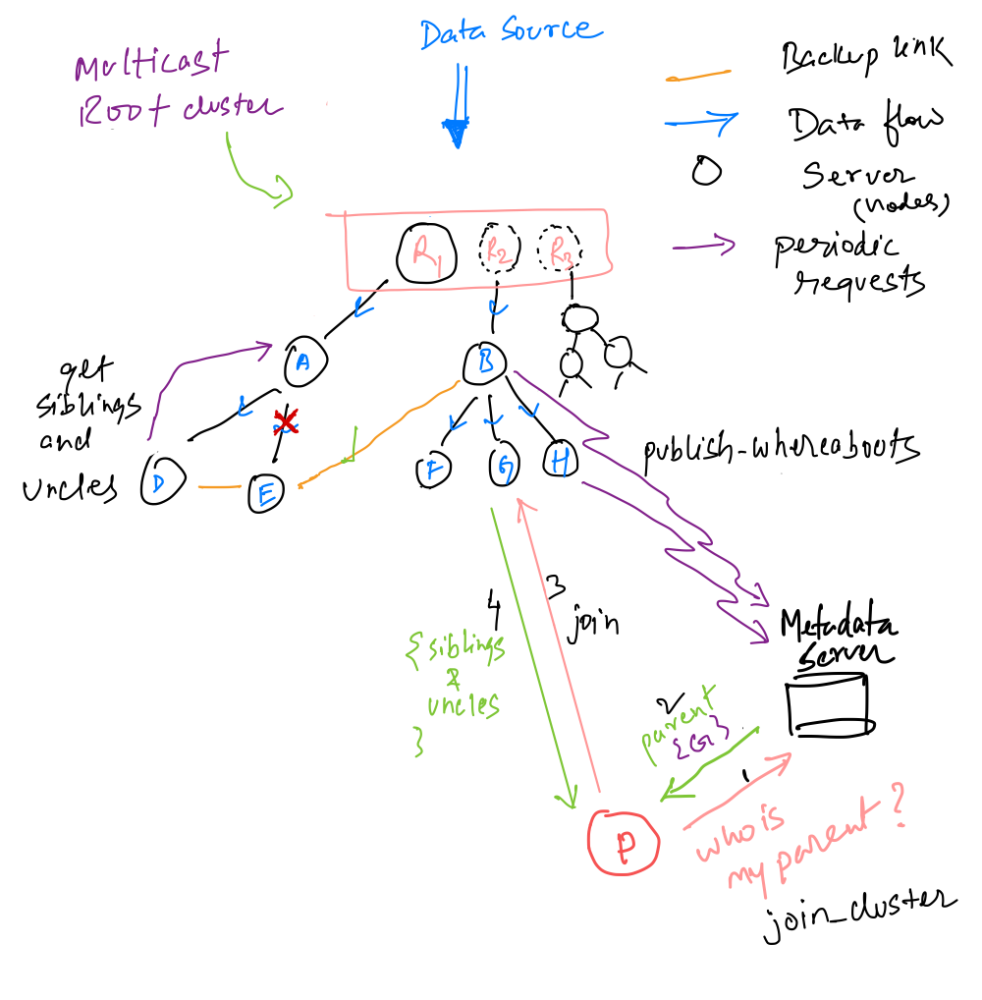
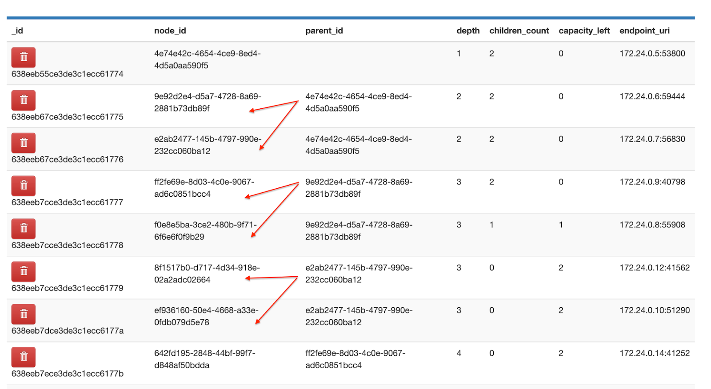

# Network Systems Final Project

## Design

Refer to the [project proposal doc](doc/FinalProject.pdf) for design ideas.



For example with branching factor (configurable) as 2, the tree topology stored in the MDS is shown below (red arrows show parent-child relationship)


## Repo Content
```bash
.
├── Dockerfile                  # Docker image file for tree node servers (tns) and metadata server (mds)
├── FinalProject.pdf
├── README.md
├── config
│   └── default.json            # Configurable options such as heartbeat frequency, host configs etc for tns/mds
├── credentials.env             # Storing sensitive info like DB password for building docker images
├── doc
│   ├── FinalProject.pdf        # Brief design doc
│   ├── PPT.pdf                 # Slides from the presentation
│   └── img
│       ├── design.png
│       └── tree.png
├── docker-compose.yml          # Orchestrator file to manage container life-cycle.
├── package-lock.json           
├── package.json                # Dependency files
├── protos                      # Protobuf definitions for gRPC calls.
│   ├── metadata_service.proto
│   └── node_service.proto
└── src                         # Source code for mds and tns
    ├── metadata_server.js
    ├── node_server.js
    └── util
        ├── db_util.js          # Various utilities for database interaction, grpc client and server communication
        ├── extra.js            # and logging.
        └── grpc_util.js

4 directories, 15 files

```

## Key RPC calls
* `MetaDataService::JoinCluster`: A node makes a RPC call to Metadata server (MDS) with cluster join request. Receives a parent node to join the cluster as response.
* `MetaDataService::PublishWhereabouts`: Tree node servers (TNS) send periodic heartbeats along with crucial metadata about their state. Metadata includes `node_id`, `parent_node_id`, `child_count` and its tree depth. MDS can then use this information to find the best parent for an incoming new node joining the cluster.
* `NodeState`: An internal state each TNS maintains to store its unique node_id, tree depth, pointer to parent and grandparent node. It also maintains its children, siblings and uncles to facilitate peer-discovery and failure recovery in case its parent node dies. 
* `NodeService::JoinParent`: A child node makes a join call to its assigned (by MDS) parent node. Parent updates its `NodeState` to reflect the node as its children.
* `NodeService::GetSiblingsAndUncles`: Child node makes periodic RPC call to its parent node to collect siblings, uncles and grandparent. Child node uses siblings and uncles info to fall back to those nodes should the parent node crashes or the upstream link breaks.

### Local calls (not implemented yet)
* `get_new_parent`: In case of failure, a node can compute the best parent locally using the metadata available from peer-discovery.
* `trigger_parent_switch`: Invokes parent `NodeService::JoinParent` RPC once `get_new_parent` returns a parent to pick. Else triggers `MetaDataService::JoinCluster` in case no suitable parent has been found.

## Setup
To setup locally with docker-compose run the following
```bash
$ git clone <repo> && cd <repo_dir>
$ docker-compose up --scale node=0 --scale mds=1 -d # starts MDS
$ docker-compose up --no-recreate --scale node=10 --scale mds=1 -d # starts a cluster of 10 tree node servers as per tree topology.
```

## Presentation Slides
[Slides](doc/PPT.pdf)
